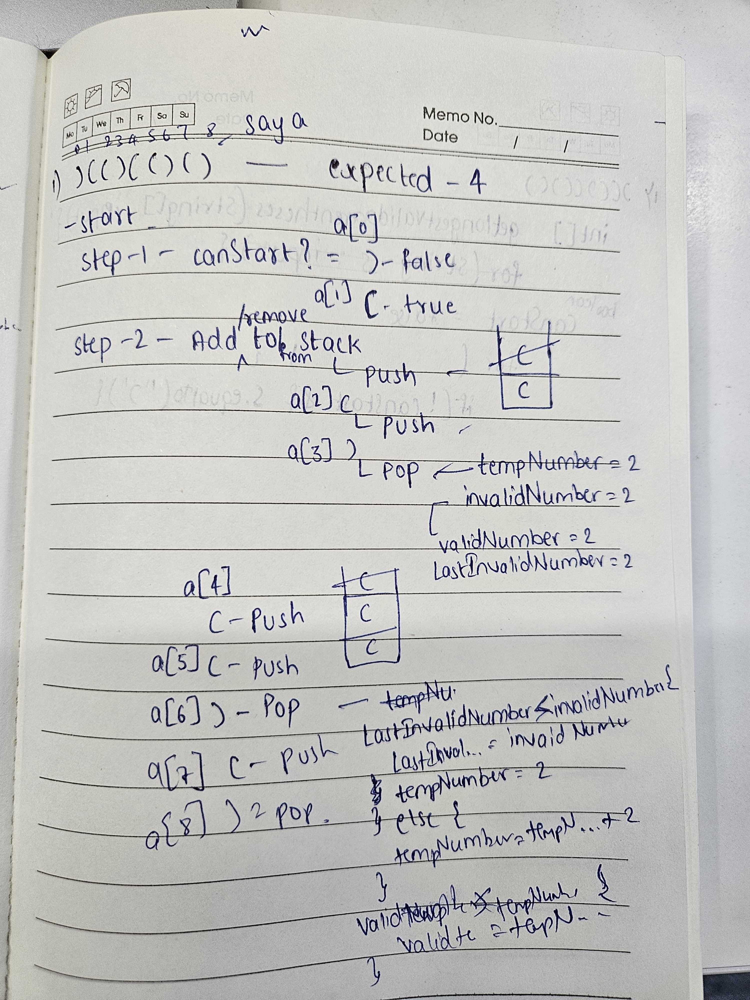
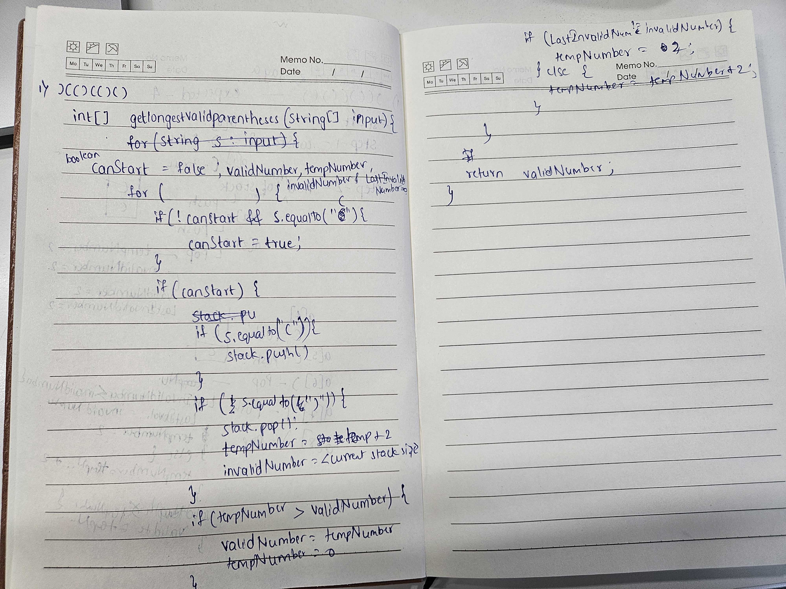

# Longest Valid Parentheses Substring

## Input and Output
| Input           | Output |
|-----------------|--------|
| ( ( ( )         | 2      |
| ( )             | 2      |
| ( ( ) )         | 4      |
|                 | 0      |
| ) ( ) ( ) )     | 4      |
| ) ) ( (         | 0      |
| ) ( ) ) ( ) ( ) | 4      |

## Dry Code

|                                                                                            |                                                                                             |
|--------------------------------------------------------------------------------------------|---------------------------------------------------------------------------------------------|
|  |  |